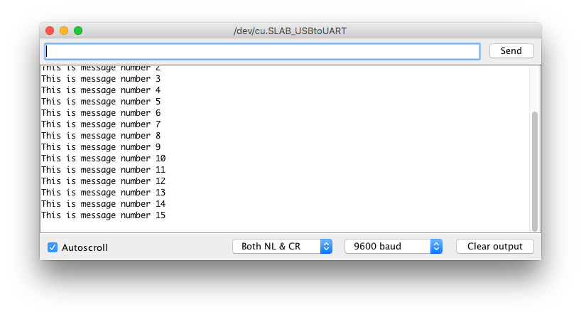
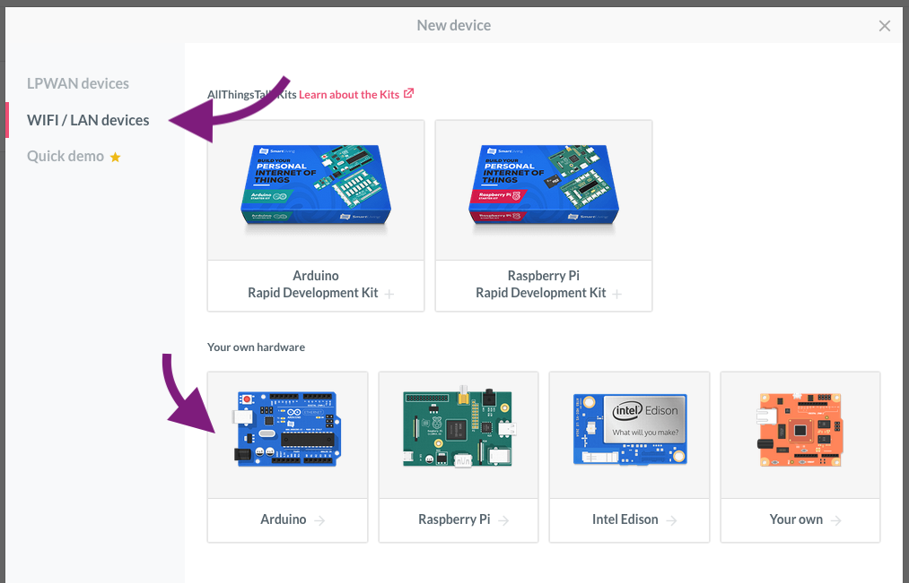
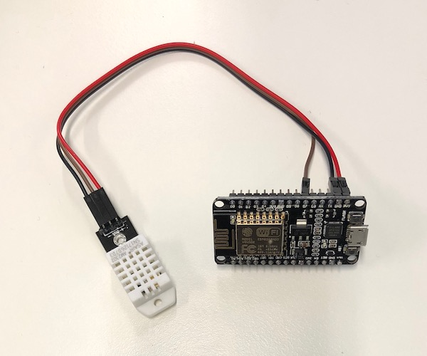
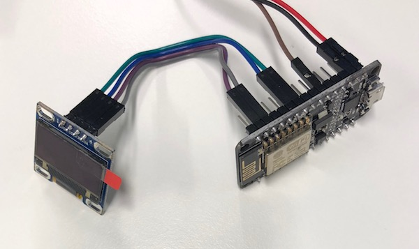

# Telia IoT Workshop
Welcome to the Telia IoT Workshop! Today we will learn some basic electronics and create a wifi-based temperature and humidity sensor.

Learn more about IoT in Telia at https://telia.no/iot and https://telia.io.

## Electric Safety
* The kit used in this workshop operates at 5 Volts and below. This means there is no risk for electric shocks, however incorrect use may still break the components themselves.
* Do not put the electronics on conducting surfaces such as metal laptops, powerbanks or other things made from metal.
* Always disconnect power before changing connections.
* Double check connections before connecting power to avoid breaking the components.

## 1. Install software


The NodeMCU is a circuit board containing the popular ESP8266 module with built-in wifi connectivity, compatible with the popular [Arduino echosystem](https://www.arduino.cc/en/Guide/Introduction). To program it, we need some software on our computer.

* Install the latest version of the Arduino IDE for you computer: https://www.arduino.cc/en/Main/Software
* Install NodeMCU CP201x USB Driver
	* [OS X](http://www.silabs.com/Support%20Documents/Software/Mac_OSX_VCP_Driver.zip)
	* [Windows](http://www.silabs.com/Support%20Documents/Software/CP210x_Windows_Drivers.zip)
	* [Linux](http://www.silabs.com/Support%20Documents/Software/Linux_3.x.x_VCP_Driver_Source.zip)
	* [Other](http://www.silabs.com/products/mcu/pages/usbtouartbridgevcpdrivers.aspx)
	
	*Note:* Mac users may need to go in to `System preferences > Security & Privacy > General` and click `Allow` to let the driver run.
* Now, we need to install support for the ESP8266 module. Open up your newly installed Arduino software and click `Arduino > Preferences...`. Insert the following URL in the box titled `Additional Boards Manager URLs`:

	```
	http://arduino.esp8266.com/stable/package_esp8266com_index.json
	```
	
* Go to `Tools > Board > Boards Manager`. Search for "esp8266", click on `esp8266 by ESP8266 Community` and then `Install`. 

	


## 2. Blink a light
Make sure everything is working by running a simple example.

* Click `File > Examples > Basics > Blink`. This should open up a new window with some code.
* Tell the computer what board we are using by clicking `Tools > Board > NodeMCU 1.0`
* Connect the NodeMCU to a USB port. Be careful to not place the board on metal as the pins may short out and break the board.
* Click `Tools > Port` and select the port. On Mac it is called `/dev/cu.SLAB_USBtoUART`. On Windows it is something like `COM3`, the number may vary. 
* Press the upload button  to compile and send the program to the NodeMCU.
* You should now see a blue LED flashing rapidly on the opposite side from the USB connector. It is indicating data being transferred as the program is uploaded to the board. 

After uploading, the blue "programmable" LED closer to the USB connector should start blinking once per second.

If uploading the code fails, try pushing the `RST` button beside the USB connector right after clicking the upload button.

**Bonus:** try changing the delays and adding in more lines to create other blinking patterns.


## 3. Print a message
It is sometimes helpful to print out a message to yourself to figure out how the code works. Try out this program and see if you understand how it works. Create a new file in the Arduino software and paste the code below, then press upload . After uploading, open the serial monitor (button on the top right).

```c
int messageNumber = 0;

void setup() {
  Serial.begin(9600);
  Serial.println("Starting program");
}

void loop() {
  Serial.println("This is message number " + String(messageNumber));
  messageNumber++;
  delay(1000);
}
```


You should see a window with text messages appearing once per second:




**Bonus:** try adding another line with ```Serial.print("Hi! ");``` and upload again. See the difference between ```print``` and ```println```?

## 4. Get connected
The hardware is working, now let's make it talk to the Internet! For today, we will use an existing IoT platform to play with the data, but it could of course also be sent directly to your own app or website.

* Go to https://maker.allthingstalk.com and sign up for an account.
* Log in, press `Connect a device` and select `WIFI/LAN devices`, then `Arduino`.

	

* Each device can have many different sensors, or "assets". Add a new asset to your device by clicking `Create asset`. Call the asset `counter` (important!) and set the type to `Integer`.

	

	You should now end up at you device page with one asset called "counter".

	

	As you can see, your brand new counter has the value "--". Let's fix that!

* You now need some code libraries and examples from AllThingsTalk. Install their SDK by following the guide at: 
  
  http://docs.allthingstalk.com/developers/sdk/arduino/

* Download the code in this repository by clicking the link below:

  https://github.com/TeliaSoneraNorge/telia-iot-workshop-wifi/archive/master.zip
  

* In Arduino, click "Sketch", "Include library", "Add .ZIP library" and coose the file you just downloaded.
* Open the example by clicking `File  > Examples > Telia-IoT-Workshop-Wifi > AllThingsTalk_counter`

	

* In the code, replace `XXXXXX` with proper values in the two variables at the top.
  
  
	```c
	// AllThingsTalk device credentials
	char deviceId[] = "XXXXXX";
	char token[] = "maker:XXXXXXXXXXXXXX";
	```


	Device ID and token can be found in AllThingsTalk. Go back to your device page and click `Settings` in the top right corner, then `Authentication`.

	

* Upload the code to the device, then go to the website to see your data updating! **Note:** it may take up to a minute before the data appears the first time. You can check the status in the serial monitor.

**Note:** There are also a couple of lines that determine what wifi to connect to. In the workshop, we have set up a router for you which has the pre-filled name and password, but once you get home you will need to change these settings to work with your home network.

```c
// Wifi settings
const char* ssid = "telia1";
const char* password = "workshop";
```

**Bonus:** Try setting up boolean, number and string assets in AllThingsTalk and see if you can send in other types of data. All assets must have different names, but they can be updated the same way in the code.

## 5. Read sensors
Now that the wifi is working, let's move on to reading data from a sensor. The kit includes a DHT22 sensor which can sense temperature and humidity ([datasheet here](https://cdn-shop.adafruit.com/datasheets/Digital+humidity+and+temperature+sensor+AM2302.pdf)). You need to install another library to handle the communication to the sensor and there is an example for how to use it included in the files you just installed.

* Disconnect the NodeMCU from the computer and wire the DHT22 sensor like this:

  
  
  | NodeMCU pin   | DHT22 pin     |
  | ------------- | ------------- |
  | 3v3           | +             |
  | GND           | -             |
  | D7            | out           |
  
* Click `Sketch > Include Library > Manage Libraries`, then search for and install
	* `DHT sensor library by Adafruit`
	* `Adafruit Unified Sensor by Adafruit` (usually the very last search result at the bottom)
* Open the example code by clicking `File > Examples > Telia-AllThingsTalk > DHT22_HumidityTemperature`. Examine the code and see how it works.
* Press upload and check that you see temperature readings in the serial monitor.

**Bonus:** Play around with the code and see if you can find the commands are used to read the temperature and humidity - you will need these later when we combine all the examples into the final project.

## 6. Write to the display
You now have sensing and connectivity in place. The third component is presenting data on the LCD display. This kit includes a SD1306 0.96" 128x64 pixel LCD display that can be used to show custom graphics. Again, there is an example availabele once you install some libraries.

* Disconnect the NodeMCU from the computer and wire the SD1306 sensor like this:

  
  
  | NodeMCU pin   | SD1306 pin    |
  | ------------- | ------------- |
  | 3v3           | VDD           |
  | GND           | GND           |
  | D1            | SCK           |
  | D2            | SDA           |
  
* Click `Sketch > Include Library > Manage Libraries`, then search for and install
	* `Adafruit SSD1306 by Adafruit`
	* `Adafruit GFX Library by Adafruit`
* Open the example code by clicking `File > Examples > Telia-AllThingsTalk > SSD1306_Display`. Examine the code and see how it works.
* The library is configured for a 128x32 display by default. If you press upload, the compiler will give you the following warning:
  
  ```c
  #error("Height incorrect, please fix Adafruit_SSD1306.h!");
  ```
  
  As it states, we need to edit a file called `Adafruit_SSD1306.h`:
  * Click `Sketch > Show Sketch Folder` to bring up a Finder or Explorer window. 
  * Navigate three levels up, to the `libraries`folder.
  * Go into `libraries/Adafruit_SSD1306/` and open `Adafruit_SSD1306.h`.
  * Scroll down to the following part on line 72-76:
  
    ```c
        -----------------------------------------------------------------------*/
	 // #define SSD1306_128_64
	 	#define SSD1306_128_32
	 // #define SSD1306_96_16
	 /*=========================================================================*/
    ```
    and change it to:
    
    ```c
        -----------------------------------------------------------------------*/
	    #define SSD1306_128_64
	 //	#define SSD1306_128_32
	 // #define SSD1306_96_16
	 /*=========================================================================*/
    ```
    * Save and close the file.
* Press upload and check that you see different graphics demos on the display.

**Bonus:** Play around with the code and try to make it display something like "20 C" in big letters.

## 7. Combine Everything
That's it, you are now a certified IoT hardware maker! The final step of this workshop is to combine all the examples so that the NodeMCU can:

* Connect to AllThingsTalk
* Read temperature and humidity from the sensor
* Display that temperature and humidity on the display
* Send that temperature and humidity to AllThingsTalk

You can, for example, start by saving a copy of the DHT22 example, then copy and paste code from the display example until you can see the sensor values on the display, then continue to add also the code from the AllThingsTalk example.

If you want some hints, there is also an example of how you might do this if you click `File > Examples > Telia-AllThingsTalk > AllThingsTalk_DHT22_SSD1306`. Just put in your `deviceId` and `token` like before and upload.

### Hints for further improvement
The provided example works fine in most cases, but does have some deliberate limitations for you to work on. For example:

* The display is not fully utilised.
* The NodeMCU sometimes prints "nan" on the display if it for some reason fails to read the sensor value. You could of course check this in the code and read the sensor again, or just not update the display until you get a proper value. 
* The code assumes everything is fine and does not reconnect if it happens to loose the wifi connection. This might happen after a few hours and force you to reset the device to make it connect again, if you do not make some changes in the code...

## Sources
To make the examples work without on the NodeMCU, original examples from AllThingsTalk and Adafruit libraries have been modified and added here to save you some time. If you have been following the guide, the originals have been installed as part of each library and should be available from `File > Examples`.

